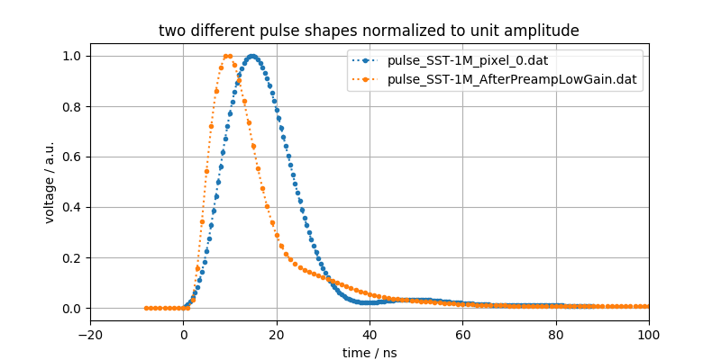

# digicam_toy
A Monte-Carlo toy for SST-1M camera readout

time_steps

This simulation can use two different types of pulse shapes.
I have no idea which one is "more correct" or which one should be used for
which kind of study, but I can show them to you.
(Normalized to the same amplitude of 1. unit)

I am also not sure about the sampling time. Might be nanoseconds though.

